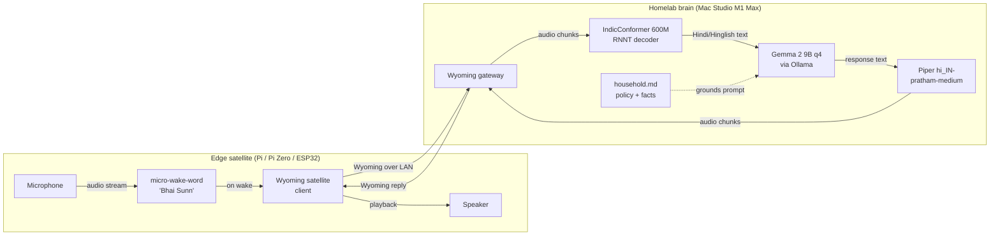
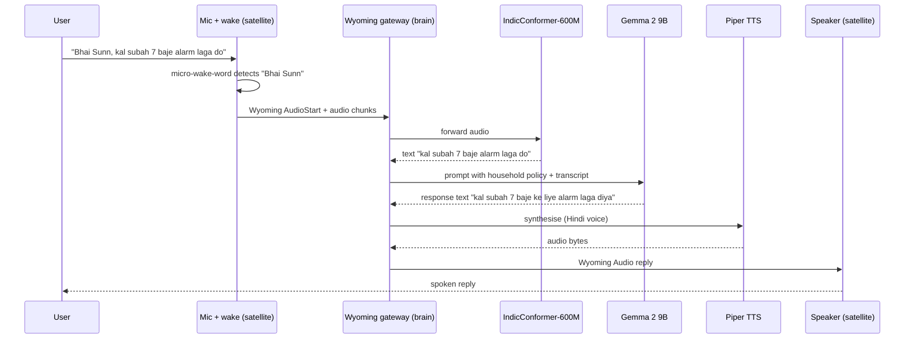

# Architecture: Bhai Sunn

**Status:** v0.1, 2026-04-29
**Reads:** vision.md
**Reads next:** bootstrap.md, prototype/test_pipeline.py

## One-line summary

A Hindi-first voice assistant built as a *Wyoming protocol* (Home Assistant's open audio-streaming wire format) two-node split: cheap **edge satellites** capture audio and run wake-word detection; a **homelab brain** does STT, LLM, and TTS. No cloud in the core path.

## Why split, not monolith

A single-board on-device build (Pi 5 8GB running everything) is feasible — the earlier RAM budget showed it fits in roughly 2.9 GB resident. But the brain side punches above its weight when the ASR model is Indic-trained rather than general-multilingual. The 2026-04-29 A/B between IndicConformer 600M and Whisper large-v3-turbo (`research/ab-results-2026-04-29.md`) showed real Hindi-quality wins — aspirated consonants preserved, proper nouns recognised — alongside a 3x latency advantage. Same trade for the LLM: Gemma 2 9B beats Gemma 2 2B on Hindi response quality. The Mac Studio runs both bigger models with headroom; the Pi cannot.

Splitting also lets the household scatter satellites cheaply. A 512MB Pi Zero 2 W or an ESP32 with the OpenHomeFoundation Voice firmware costs an order of magnitude less than a Pi 5, and once the brain is bigger, the satellite has nothing to gain from being beefier.

## ASCII layout

```
+-------------------+               +-----------------------------------+
|                   |               |                                   |
|  EDGE SATELLITE   |    Wyoming    |      HOMELAB BRAIN (Mac Studio)   |
|  (Pi 5 / Pi Zero  |  (audio +     |                                   |
|   / ESP32)        |   intents     |   +-----------+   +-----------+   |
|                   |   over LAN)   |   | Wyoming   |   | Indic-    |   |
|  +----------+     |  ===========> |   | gateway   |-->| Conformer |   |
|  | mic      |     |               |   +-----------+   | 600M      |   |
|  +----------+     |               |        |          | (RNNT)    |   |
|       |           |               |        |          +-----------+   |
|       v           |               |        v                |         |
|  +----------+     |               |   +-----------+         |         |
|  | micro-   |     |               |   | LLM       |<--------+         |
|  | wake-    |     |               |   | Gemma 2 9B|                   |
|  | word     |     |               |   | q4_K_M    |                   |
|  +----------+     |               |   | (Ollama)  |                   |
|       |           |               |   +-----------+                   |
|       v           |               |        |                          |
|  +----------+     |  <===========     |    v                          |
|  | speaker  |     |   audio reply     | +-----------+                  |
|  +----------+     |                   | | Piper     |                  |
|                   |                   | | hi_IN-    |                  |
+-------------------+                   | | pratham   |                  |
                                        | +-----------+                  |
                                        |                                |
                                        +--------------------------------+
```

## Component diagram



## Sequence: one utterance



## RAM budget

### Edge satellite (Pi 5 8GB or smaller)

| Component | Resident RAM |
|---|---|
| micro-wake-word ("Bhai Sunn", custom-trained) | ~5 MB |
| Wyoming satellite client (Python) | ~50 MB |
| OS + audio stack (ALSA / PulseAudio) | ~250 MB |
| **Total** | **~305 MB** |

The satellite fits in a 512 MB Pi Zero 2 W with comfortable headroom. A Pi 5 is overkill for this role and is recommended only if the household wants one device per room with future-proofing for v2 integrations.

### Homelab brain (Mac Studio M1 Max 32GB)

| Component | Resident RAM |
|---|---|
| Wyoming gateway service | ~100 MB |
| IndicConformer 600M (loaded, fp32) | ~2.4 GB |
| Gemma 2 9B q4_K_M via Ollama | ~5.5 GB |
| Piper hi_IN-pratham-medium | ~80 MB |
| Inference peak (KV cache + audio buffers) | ~700 MB |
| **Total resident at idle** | **~8.1 GB** |
| **Peak under load** | **~8.8 GB** |

Mac Studio already runs Ollama (qwen2.5:7b, ~6 GB) and pipeline-api / ingest-worker / n8n. Total fleet at peak still fits within 32 GB with multi-GB headroom.

## Trade-off table: brain LLM choice

| Model | Params | Resident (q4_K_M) | Hindi quality | Latency on M1 Max | Verdict |
|---|---|---|---|---|---|
| Qwen 2.5 1.5B | 1.5B | ~1.0 GB | Weak | ~25 t/s | Reject — Hindi is shallow |
| Gemma 2 2B | 2B | ~1.6 GB | Decent | ~22 t/s | Fallback for Pi-only build |
| Llama 3.2 3B | 3B | ~2.0 GB | Decent-good | ~18 t/s | Reasonable middle path |
| Gemma 2 9B | 9B | ~5.5 GB | **Strong** | ~12 t/s | **v1 default** |
| Qwen 2.5 14B | 14B | ~8.5 GB | Strong | ~7 t/s | Headroom exists, latency penalty |
| Llama 3.1 70B | 70B | ~42 GB | Frontier | OOM | Reject — does not fit |

Default: Gemma 2 9B q4_K_M. Falls back to Gemma 2 2B if the household runs the Pi-only build.

## Trade-off table: STT choice on Mac Studio

| Engine | Decoder | Warm STT (M1 Max) | Hindi quality | Licence | Notes |
|---|---|---|---|---|---|
| Whisper large-v3-turbo (mlx) | autoregressive | 465-523ms | drops aspirated consonants (बाई for भाई); hallucinates proper nouns | MIT | **Decommissioned 2026-04-30.** Generalist multilingual; lost the A/B on Hindi quality and on latency. |
| IndicConformer 600M | RNNT | 184ms | preserves aspiration; recognises Indic proper nouns | MIT | **v1 default.** Indic-trained on AI4Bharat IN-22 corpus. |
| IndicConformer 600M | CTC | 128-150ms | similar to RNNT, occasionally drops nasals (पैट for पैंट) | MIT | Faster, streaming-friendly, ~75ms cheaper. Use when latency dominates quality. |
| IndicSeamless 2B | seq2seq | not benchmarked | claims SOTA FLEURS-Hindi (translation, not pure ASR) | **CC BY-NC** | Rejected on licence; vision.md commits to fully open-source. |

Default: IndicConformer 600M with the RNNT decoder. The Conformer architecture is a pure-ASR design (hybrid CTC+RNNT in a single forward pass) trained by AI4Bharat on Indic data. The RNNT decoder is non-autoregressive in a way that pays off on Apple Silicon CPU even without MLX — see `research/ab-results-2026-04-29.md` for the head-to-head and `research/primer-gguf-pytorch-ollama-mlx.md` for why this was a counter-intuitive result.

## Trade-off table: TTS

| Engine | Hindi voice | CPU footprint | Latency | Quality | Verdict |
|---|---|---|---|---|---|
| Piper hi_IN-pratham-medium | Yes | ~80 MB, fast | <500 ms for short replies | Robotic but intelligible | **v1 default** |
| Piper hi_IN-pratham-low | Yes | ~30 MB, very fast | <200 ms | Noticeably worse | Reject |
| NeuTTS-Air | No (English only today) | ~500 MB-1 GB | Streaming | Excellent | Defer until Hindi voice ships |
| Coqui XTTS v2 | Yes (multilingual) | ~2 GB | Slow | Strong but heavy | Reject — overkill, not maintained |

## Wake-word design

micro-wake-word (TFLite Micro classifier) trained on:
1. **Synthetic data via Piper.** Generate ~5,000 samples of "Bhai Sunn" in varied Hindi voices, with Piper as the data factory. This bootstraps a usable model in hours.
2. **Real samples (recommended).** Collect ~500 utterances from household members in real rooms, real conditions (kitchen noise, fan, TV background). Mix 70/30 real/synthetic for the final model.
3. **Negative examples.** Random Hindi conversation samples, Hinglish phone calls, household audio captured during a 24-hour passive recording session — labelled negative.

Risk: "Bhai Sunn" is two short syllables. Wake-word literature suggests 3+ syllables train more reliably. If false-positives exceed 2% during testing, the fallback wake phrase is "Bhaiya Sunn" (three syllables, same idiomatic register).

## Data flow boundaries

| Boundary | Direction | Data crossing | Notes |
|---|---|---|---|
| Mic → Satellite | inbound | raw audio | Never leaves the satellite unless wake-word fires |
| Satellite → Brain | outbound (LAN) | audio chunks (post-wake) | Wyoming over LAN; never WAN |
| Brain → Internet | outbound (optional) | explicit web-lookup intents only | Off by default |
| Brain → Brain disk | inbound | full audio + transcript | Optional debug log; off in v1 default |

The default v1 deployment has no path that puts household audio on the public internet. Cloud connectivity is opt-in, intent-by-intent.

## Phased delivery

| Phase | Scope | Demo-able |
|---|---|---|
| **Phase 0** | Smoke test: record 5 s Hindi audio on Mac Studio, transcribe, generate Hindi reply, speak it. No satellite, no wake-word. | A single Python script |
| **Phase 1** | Wyoming server on Mac Studio. Wyoming satellite on Pi 5 with built-in stock wake-word ("ok nabu" from openWakeWord). End-to-end voice loop over LAN. | One satellite, one brain, one room |
| **Phase 2** | Custom "Bhai Sunn" wake-word trained and deployed. Replace stock wake. | Same demo, new keyword |
| **Phase 3** | Household policy file (`household.md`). LLM grounds responses in household facts (members, schedules, room names). | Personalised replies |
| **Phase 4** | Music Assistant + Home Assistant integration via Wyoming. Light switches, music control. | Smart home parity with Alexa baseline |

Phases 0 to 2 are v1. Phases 3 and 4 are v2.

## What this depends on (and where it lives in agent-brain)

- **Mac Studio host**: `projects/products/mac-studio-setup/` — already documents launchd services, Ollama, and the homelab service convention. Bhai Sunn brain services follow the same pattern.
- **Wiki concepts grounding the design**: `wiki/concepts/platform-lock-in.md`, `wiki/concepts/vendor-lock-in.md`, `wiki/sources/platformland.md`.
- **Earlier orchestrator-worker discipline**: `projects/experiments/local-llm_liv/` — same simplicity-first stance, no LangGraph.
- **STT decision basis**: `research/ab-results-2026-04-29.md` — A/B run that promoted IndicConformer 600M (RNNT) over Whisper large-v3-turbo on aspiration, proper-noun recognition, and latency. The earlier MLX-vs-faster-whisper memory rule still holds for Whisper specifically; this project no longer uses Whisper.

## References

| File | Purpose |
|---|---|
| `vision.md` | What this is and why; political framing; success criteria |
| `bootstrap.md` | Step-by-step install for brain and satellite |
| `prototype/test_pipeline.py` | Phase 0 smoke test, runs on Mac Studio alone |
| `CLAUDE.md` | Project status, decisions, open questions |
| `https://github.com/music-assistant/voice-support` | Upstream Music Assistant voice prior art |
| `https://github.com/OHF-Voice/micro-wake-word` | Wake-word engine |
| `https://www.home-assistant.io/voice_control/` | Wyoming protocol reference (HA Voice docs) |
