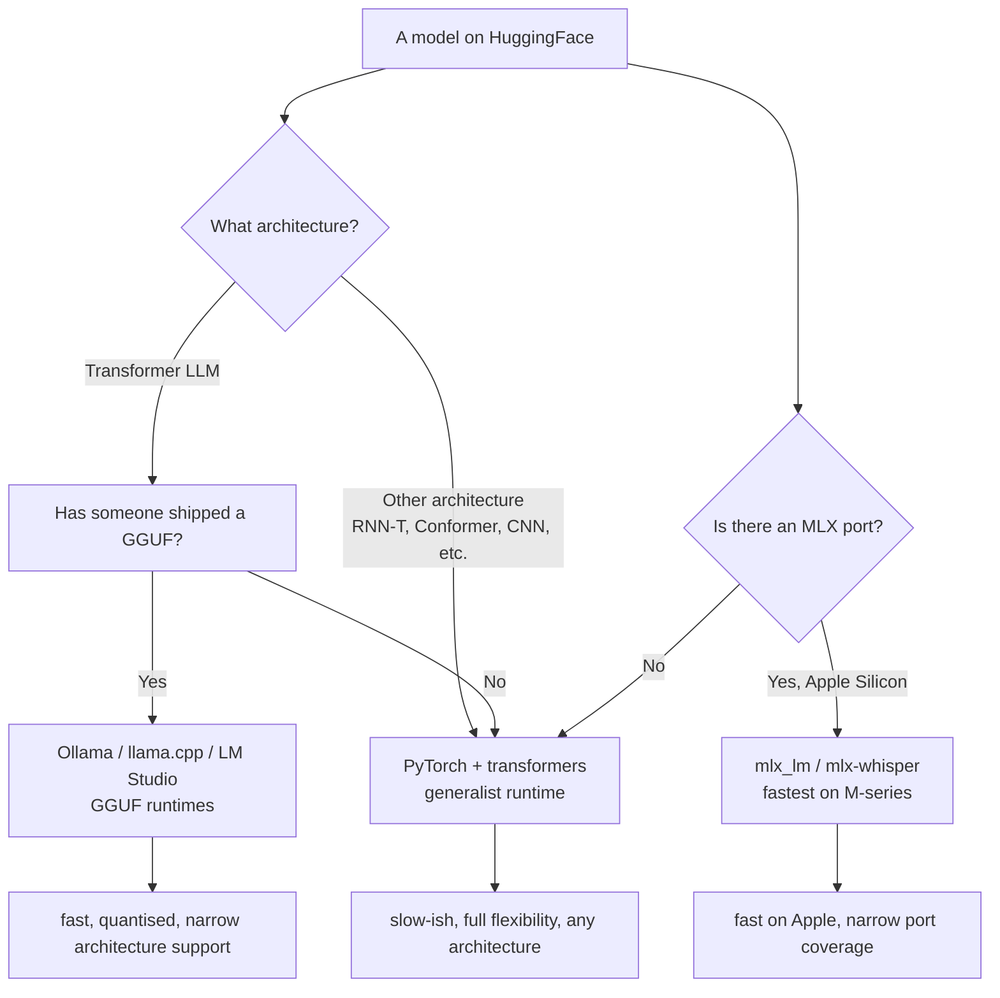
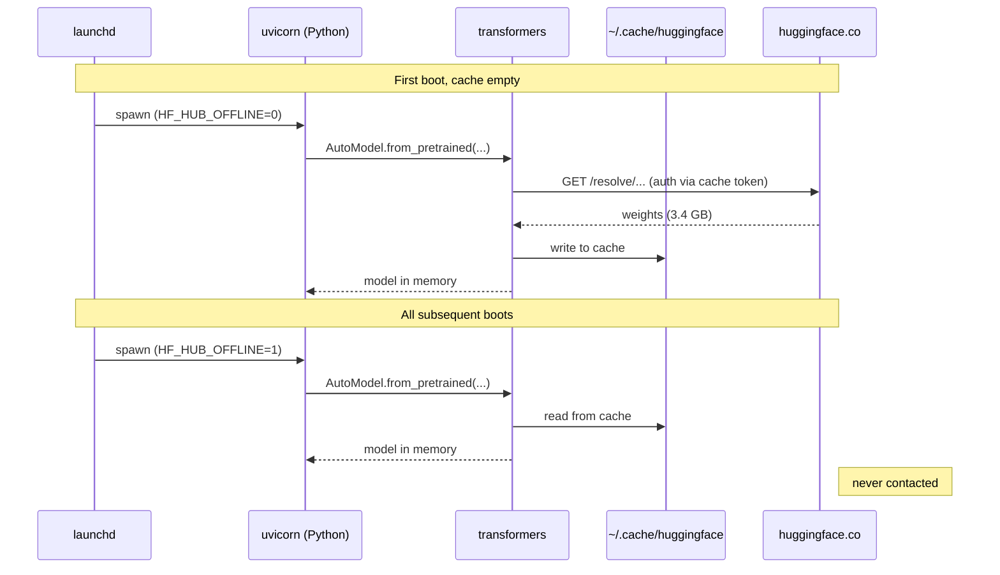

# Primer: GGUF, PyTorch, Ollama, MLX, and the Bhai Sunn STT decision

**Audience:** anyone joining the project who wants to understand the runtime stack we landed on, why Ollama could not host the IndicConformer model, and why a "smaller" CPU-Torch model beat a "larger" Apple Silicon-MLX model in the A/B.

**Status:** v0.1, 2026-04-30

---

## What runs a model

Three things have to come together for an inference call: a **runtime** (the program that does the matrix maths), a **format** (the file the weights are stored in), and an **architecture** (the shape of the network the runtime knows how to walk). Mix them up and nothing loads.

Our project has crossed all three boundaries in a week. This document fixes the language so future decisions don't relitigate them.

```
+----------------------------------------------------------------+
|                        INFERENCE RUNTIMES                      |
|                                                                |
|  +-------------+   +-----------------+   +------------------+  |
|  | PyTorch     |   | llama.cpp       |   | MLX (Apple)      |  |
|  | + transformers   | (and ggml)      |   |                  |  |
|  | (Python/C++)|   | (C++)           |   | (Swift/C++/Py)   |  |
|  +-------------+   +-----------------+   +------------------+  |
|        |                   |                       |           |
|        v                   v                       v           |
|  reads HF native     reads GGUF only        reads MLX-format   |
|  (.safetensors,      (single binary,        (.npz / safetensors|
|   .bin)              quantized)              with mlx weights) |
|                                                                |
|  any architecture:   transformer LLMs        any architecture: |
|  CNN, RNN, Conformer, only (and a few         CNN, RNN, transformer|
|  transformer, etc.   speech models)           etc.             |
|                                                                |
+----------------------------------------------------------------+
        |                       |                        |
        v                       v                        v
   slowest cold-start,     fastest CPU on               fastest on Apple
   most flexible,          quantised LLMs,              Silicon when the
   needs Python+C++        smallest disk,               architecture is
                           ONE thing (autoreg. LLM)     ported to MLX

+----------------------------------------------------------------+
|                       SERVICE WRAPPERS                         |
|                                                                |
|  +-----------+    +-----------+   +-----------+   +---------+  |
|  | uvicorn / |    | Ollama    |   | LM Studio |   | vLLM    |  |
|  | FastAPI   |    | (over     |   | (GUI over |   | (server |  |
|  | (custom)  |    |  llama.cpp|   |  llama.cpp|   | over    |  |
|  +-----------+    |  + Modelfile  |  + GGUF)  |   |  Torch) |  |
|        |           +-----------+   +-----------+   +---------+ |
|        v                                                       |
|  hosts whatever your Python loads — including PyTorch +        |
|  HuggingFace + custom-architecture models like IndicConformer  |
+----------------------------------------------------------------+
```

The bhai-sunn STT server is the leftmost combo: *uvicorn* (an async Python web server) wrapping *PyTorch* (Meta's tensor library) plus *transformers* (HuggingFace's model loading library) plus a custom Conformer architecture (AI4Bharat's NeMo-style code, loaded via `trust_remote_code=True`). That stack imposes no constraints on what the model architecture can be — it's a generalist runtime. The trade-off is that nothing about it is optimised; it just runs whatever PyTorch can run.

---

## What is GGUF, really

*GGUF* (GPT-Generated Unified Format) is a binary model file format. One file holds the weights and the metadata (tokenizer, vocab, prompt template, quantisation scheme). It was designed by the *llama.cpp* project — a C++ implementation of inference for transformer language models — to be the on-disk format that llama.cpp loads.

Two facts about GGUF that are easy to miss:

1. **GGUF is not a generic AI format.** It is the format llama.cpp reads. Tools like *Ollama* and *LM Studio* are wrappers around llama.cpp, so they read GGUF too. But anything *not* built on llama.cpp (PyTorch, MLX, ONNX runtime, JAX) does not natively read GGUF, and would need a converter.

2. **GGUF only carries architectures llama.cpp implements.** llama.cpp was originally written for the LLaMA transformer (hence the name), and has since extended to support most autoregressive transformer LLMs — Llama 1/2/3, Mistral, Qwen, Gemma, Phi, etc. It does not natively run convolutional models, RNN-T speech decoders, or anything outside the transformer-LLM lane. **There is no GGUF for IndicConformer because llama.cpp doesn't implement the Conformer architecture.**

So when the user says "pull the model with Ollama" — that needs both (a) GGUF format and (b) llama.cpp-supported architecture. Conformer fails on (b).

---

## What is PyTorch

*PyTorch* is a tensor library — a programming framework for building and running neural networks. You define a model in Python, PyTorch handles GPU/CPU dispatch, automatic differentiation (for training), and the actual matrix multiplications.

PyTorch is the *generalist* runtime. Any architecture you can describe in Python is one PyTorch can run. Conformer? Yes. Whisper? Yes. Stable Diffusion? Yes. Custom novel architecture nobody else has implemented? Yes, as long as it's pure Python plus PyTorch ops.

The cost of being generalist is overhead. PyTorch loads the whole Python interpreter, allocates GPU/CPU buffers eagerly, and runs operations dispatched through Python — slower than a hand-tuned C++ runtime that knows exactly one architecture.

For our STT model, PyTorch is the only runtime that runs Conformer at all today. Specialised C++ runtimes (llama.cpp, MLX) haven't ported the architecture.

---

## What is Ollama

*Ollama* is a lightweight server that wraps llama.cpp behind an HTTP API and a model-pulling convenience layer. You run `ollama pull gemma2:9b`, Ollama downloads a GGUF file, and `ollama run gemma2:9b "hi"` invokes llama.cpp under the hood. The Modelfile system lets you bundle a model with prompt templates and parameters.

Ollama is excellent at what it does. The wiki captures it as the project's *offline-batch-worker* (`wiki/entities/ollama.md`): a tool for "non-latency-sensitive tasks that require high-volume processing without incurring external API costs". Inside the homelab it serves Qwen 2.5 7B and Nomic Embed for batch jobs.

But Ollama inherits llama.cpp's scope: text LLMs in GGUF. Conformer is neither. **Telling Ollama to pull `ai4bharat/indic-conformer-600m-multilingual` is a category error**, like asking a CD player to load a Blu-ray disc.

This is why our STT server is a separate process — uvicorn + FastAPI + transformers + PyTorch, not Ollama. They are sibling services, not parent-and-child. Both run on the Mac Studio, both are managed by launchd, both bind 127.0.0.1, but they are wholly distinct stacks.

---

## What is MLX

*MLX* is Apple's tensor library, designed specifically for Apple Silicon. It exploits *unified memory* — the M-series chips' shared CPU/GPU/Neural-Engine RAM pool, where there is no copy-cost between processing units (`wiki/concepts/unified-memory.md`). Models that have been ported to MLX format run much faster on M-series chips than the same model in a generic PyTorch CPU path, often 5-10x.

That's where the MLX-vs-faster-whisper memory rule (`feedback_mlx_whisper_apple_silicon.md`) came from: faster-whisper on Mac is CPU-only and ~10x slower than the MLX port. So the working assumption coming into our STT comparison was straightforward — "use MLX where it exists, fall back to CPU only when forced".

We were wrong about how that assumption applied to Conformer. Read on.

---

## How the four pieces fit together



The arrows fork on two questions: what is the architecture, and has anyone done the port work? For new or niche architectures, you fall back to the generalist runtime (PyTorch + transformers) every time — not because it's the best fit, but because it's the only runtime that runs the model at all.

For Bhai Sunn:
- Whisper had MLX coverage → we ran it via mlx-whisper (`mlx-community/whisper-large-v3-turbo`)
- IndicConformer had no MLX port and no GGUF → we ran it via PyTorch + transformers

You'd expect MLX to win that comparison handily. It didn't.

---

## Why MLX-Whisper lost to PyTorch-Conformer

The A/B (`research/ab-results-2026-04-29.md`) showed Conformer at 128-184ms STT vs Whisper at 465-523ms — Conformer 3x faster, on the same Mac Studio, despite running on the slower runtime. Three reasons, in increasing order of importance:

### 1. Conformer is smaller (600M vs 809M params)

Marginal. Conformer is roughly 25% fewer parameters than Whisper turbo. That alone would buy us ~25% latency, not 3x.

### 2. Conformer's training data was Indic-specific

This drives the *quality* gap (correct "भाई" vs Whisper's "बाई"; "अदम्या" vs Whisper's hallucinated "अदम्यागी") but doesn't explain latency.

### 3. Decoding architecture, not parameter count

This is the real story. **Whisper is autoregressive; Conformer (in CTC mode) is not.**

*Autoregressive* means the model generates tokens one at a time, each token conditioned on the previous ones. Whisper's decoder transforms the audio encoding into text token by token, with a transformer self-attention pass over all previously generated tokens for every new token. For a 10-token reply, that's 10 sequential decoder passes.

*CTC* (Connectionist Temporal Classification) is a non-autoregressive decoder. It produces all output frames in parallel in a single forward pass, then collapses repetitions and blanks to get the final transcript. One pass, regardless of utterance length.

*RNNT* (Recurrent Neural Network Transducer) is between the two. It loops over output tokens but in a much lighter way than transformer attention.

So the per-token cost on Whisper grows linearly with output length, and each step is expensive (full self-attention). Conformer-CTC's cost is essentially flat. On 2-3 second utterances with 5-10 word transcripts, the autoregressive overhead dominates whatever MLX saves on raw matrix throughput.

The lesson: **MLX's hardware acceleration matters less than the decoder's algorithmic shape.** A non-autoregressive decoder in plain PyTorch can beat an autoregressive decoder on the Apple Neural Engine, because the latter is doing more total work.

We could have predicted this from the architecture papers, but the working memory rule ("MLX wins on Apple Silicon") hid it. The empirical A/B exposed the assumption.

---

## Trade-off table: STT runtime choices we considered

| Runtime + format | Conformer? | Whisper? | Apple Silicon perf | Why it's in or out |
|---|---|---|---|---|
| Ollama / llama.cpp + GGUF | No (architecture not in llama.cpp) | No (Whisper isn't a chat LLM) | n/a | **Out** — wrong category of runtime entirely |
| PyTorch + transformers (HF native) | Yes | Yes (slow, no MLX path) | medium | **In, default for STT.** Generalist; slower than MLX on Whisper but the only path for Conformer |
| MLX + mlx-whisper | No (no MLX Conformer port today) | Yes (fast) | very fast | Was our v0; superseded by Conformer |
| ONNX Runtime + onnx | Yes (model card documents it) | Yes (community ports) | medium | Plausible alternative for Conformer; not benchmarked yet |
| NVIDIA NeMo (the framework Conformer was built in) | Yes, native | n/a | n/a (no CUDA on Mac) | Out for our hardware; the .nemo checkpoint is the upstream artefact |

---

## The HuggingFace gate and offline mode

A separate but related piece of plumbing: gated HuggingFace repos and offline mode.

`ai4bharat/indic-conformer-600m-multilingual` is *gated* — the upstream maintainers require users to accept a click-through licence and authenticate with a HuggingFace token (`hf_...`) before downloading. Until you do, every API call returns 401.

Once authenticated, transformers downloads the weights to `~/.cache/huggingface/hub/`. That cache is durable; the weights stay on disk indefinitely. **Once cached, the model can load without contacting HuggingFace at all** — but only if you tell transformers to stay offline. Default behaviour is to ping HF on every `from_pretrained` call to check for upstream updates, and that ping needs a valid token because the repo is gated.

Set two environment variables in the launchd plist:

```
HF_HUB_OFFLINE=1
TRANSFORMERS_OFFLINE=1
```

With those set, transformers loads from cache and never makes a network call. The token can be rotated freely after that — the old one stops working, the new one isn't needed, the server keeps running. We'd only need a fresh token if we wanted to update the model or pull a different one.

This is the standard pattern for production HF deployments: pull-once-online, run-forever-offline.



---

## How to inspect what's loaded (numbered, with success criteria)

### Step 1: confirm the launchd service is running

What: ask launchd for the service state.
Why: if it says "not running" everything else is moot.

```bash
launchctl print gui/$(id -u)/com.anchit.bhai-sunn-stt | grep -E "state|pid"
```

Success: `state = running` and a numeric PID.

### Step 2: confirm offline mode is wired

What: read the env vars launchd injected.
Why: the offline guarantee depends on these being set; if they're not, the server will silently fall back to online and need a valid token.

```bash
launchctl print gui/$(id -u)/com.anchit.bhai-sunn-stt | grep -E "HF_HUB_OFFLINE|TRANSFORMERS_OFFLINE"
```

Success: both keys present, both set to `1`.

### Step 3: confirm the model is warm

What: hit the server's health endpoint.
Why: warmth means the constructor finished and the dummy inference ran; warm latency from here is real.

```bash
curl -s http://127.0.0.1:8765/health
```

Success: `{"warmed": true, "model": "ai4bharat/indic-conformer-600m-multilingual", ...}`.

### Step 4: confirm transcription works end to end

What: POST a real audio file and read back the transcript.
Why: this is the production wire; if anything's broken in the request path, this is where it shows.

```bash
curl -s -X POST http://127.0.0.1:8765/transcribe \
  -H 'Content-Type: application/json' \
  -d '{"path": "/absolute/path/to/audio.ogg"}' | python3 -m json.tool
```

Success: a JSON response with `text`, `decoder: "rnnt"`, and `timings.stt` under 200ms for short utterances.

### Step 5: rotate the HF token

What: invalidate the current token and confirm the server still works.
Why: the token sits in chat history and on disk; rotation is hygiene.

```bash
# Delete the old token from local cache
rm -f ~/.cache/huggingface/token ~/.cache/huggingface/stored_tokens

# Then revoke at https://huggingface.co/settings/tokens

# Kickstart the service
launchctl kickstart -k gui/$(id -u)/com.anchit.bhai-sunn-stt

# Verify
curl -s http://127.0.0.1:8765/health
```

Success: `warmed: true`, transcription continues to return the same text. With OFFLINE=1, the absent token doesn't matter.

---

## Glossary in one paragraph

*PyTorch* — Python tensor library, runs any model architecture. *transformers* — HuggingFace library that loads models from HF Hub into PyTorch. *llama.cpp* — C++ inference for transformer LLMs from one *GGUF* (GPT-Generated Unified Format) binary file. *Ollama* — convenient HTTP wrapper around llama.cpp. *LM Studio* — GUI wrapper around llama.cpp. *MLX* — Apple's tensor library exploiting *unified memory* on Apple Silicon. *ONNX* — vendor-neutral intermediate format for converting models between frameworks. *autoregressive decoder* — generates one output token at a time, each conditioned on the last. *CTC decoder* — generates all output frames in parallel, then collapses. *RNNT decoder* — light recurrence over outputs, between autoregressive and CTC. *gated repo* — HuggingFace model that requires a click-through licence and an authenticated token. *HF_HUB_OFFLINE* — environment flag that tells transformers to load only from local cache. *FastAPI / uvicorn* — Python async web server framework hosting our Conformer endpoint.

---

## References

- `prototype/stt_server.py` — the actual server hosting Conformer in this stack
- `research/ab-results-2026-04-29.md` — the empirical A/B that overturned the MLX assumption
- `research/decommission-mlx-whisper-2026-04-30.md` — formal record of the Whisper decommission and Conformer promotion
- `research/stt-ab-test-conformer-vs-whisper.md` — the A/B harness design and discussion archive
- `~/Library/LaunchAgents/com.anchit.bhai-sunn-stt.plist` — the launchd plist with offline-mode env vars
- `wiki/concepts/gguf.md` — wiki entry on GGUF
- `wiki/concepts/cpu-inference.md` — wiki entry on CPU inference and the GGUF + llama.cpp + quantisation stack
- `wiki/concepts/unified-memory.md` — wiki entry on Apple Silicon's unified-memory architecture and what it means for local AI
- `wiki/concepts/llama-cpp-python.md` — Python bindings for llama.cpp
- `wiki/entities/ollama.md` — wiki entry on Ollama as the homelab's offline-batch-worker
- [openai/whisper-large-v3-turbo on HuggingFace](https://huggingface.co/openai/whisper-large-v3-turbo)
- [ai4bharat/indic-conformer-600m-multilingual on HuggingFace](https://huggingface.co/ai4bharat/indic-conformer-600m-multilingual) (gated)
