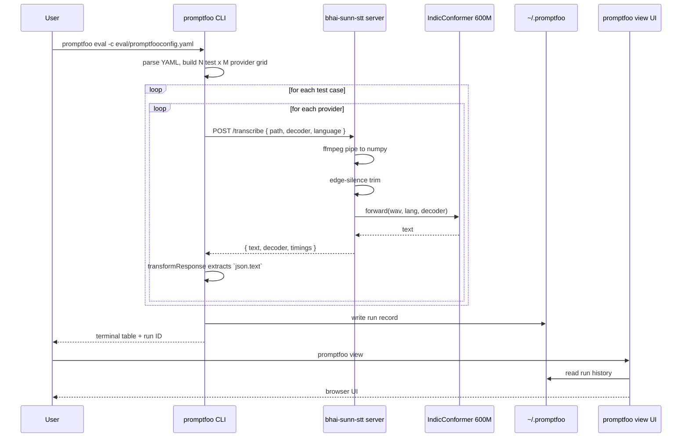

# Promptfoo Eval Setup for Bhai Sunn STT

**Status:** v0.1, 2026-04-30
**Audience:** anyone (Adamya included) cloning the repo and running the eval against their own machine.

This document explains how the Promptfoo-based STT eval is wired, how to run it, and how to extend it. The eval is the *exclusive* test surface for STT changes in this project — every model swap, decoder change, or accuracy tweak goes through here, not through ad-hoc curl calls.

---

## What Promptfoo is, very briefly

*Promptfoo* is an evaluation harness for LLMs and audio models. It takes a YAML config that lists *providers* (callable models, in our case HTTP endpoints) and *tests* (input data with optional reference outputs and assertions). It runs every test against every provider, captures outputs, applies assertions, and renders a side-by-side comparison table — in the terminal and in a browser UI at `promptfoo view`.

The product surface is simple: change YAML, re-run, read the table.

For the deeper mechanics of why we use HTTP providers (model warmth) and why the STT server is a separate persistent service rather than an inline Python provider, see `research/primer-gguf-pytorch-ollama-mlx.md`.

---

## How the eval is wired

```
+-----------------------------------------------------------------+
|                                                                 |
|  Developer machine                                              |
|                                                                 |
|  +---------------------+         +------------------------+     |
|  | promptfoo CLI       |         | Mac Studio (or local) |     |
|  |                     |         |                        |     |
|  | reads YAML:         |         | launchd service:       |     |
|  |   eval/promptfoo-   |         | com.anchit.bhai-sunn-stt|    |
|  |   config.yaml       |         |                        |     |
|  |                     |         | uvicorn + FastAPI      |     |
|  | for each test x     |  POST   |   prototype/stt_server |     |
|  | each provider:      | ----->  |                        |     |
|  |                     |         | IndicConformer 600M    |     |
|  | sends HTTP body     |  text   |   (RNNT or CTC)        |     |
|  | { path, decoder,    | <-----  |                        |     |
|  |   language }        |         | reads audio from       |     |
|  |                     |         | fixtures/audio/*.oga   |     |
|  +---------------------+         +------------------------+     |
|        |                                                        |
|        v                                                        |
|  +--------------------------------------+                       |
|  | local SQLite under                   |                       |
|  | ~/.promptfoo (results history)       |                       |
|  +--------------------------------------+                       |
|        |                                                        |
|        v                                                        |
|  +--------------------------------------+                       |
|  | promptfoo view                       |                       |
|  |   localhost:15500                    |                       |
|  |   browser UI: side-by-side, history, |                       |
|  |   diffs, search, exports             |                       |
|  +--------------------------------------+                       |
|                                                                 |
+-----------------------------------------------------------------+
```

The CLI doesn't run the model. It is a coordinator: it reads YAML, fans tests across providers, posts JSON over HTTP, captures the response, and writes results to a local SQLite. The actual ASR work happens in the long-running launchd-managed server.

---

## Sequence of one eval run



---

## Trade-off table: the three eval shapes

| Shape | What it produces | Pre-req | Best for | Status in this repo |
|---|---|---|---|---|
| **Compare** | side-by-side transcripts, no pass/fail | nothing | first-look quality check, decoder selection | **active in v0** — every test passes by default; you read the transcripts |
| **WER** | per-test pass/fail + WER score | hand-transcribed `ground_truth` per test | rigorous accuracy gate before promoting a model | scaffolded — see commented-out `defaultTest.assert` block in the YAML; activate once labelled set exists |
| **LLM-judge** | per-test verdict from a judge model | API key for a judge (Gemini / Claude / GPT-4) | spot-checks where hand-transcribing is too expensive | not wired; future option |

We are deliberately at v0 (compare). The path to v1 is hand-transcribing 30+ utterances; until then a quantitative accuracy claim is honest only as anecdote.

---

## Files in the eval surface

```
eval/
  promptfooconfig.yaml       the eval definition: providers + tests
fixtures/
  audio/
    tg-001-greeting.oga      "Bhai Sunn kaisa hai" (2.09s)
    tg-002-adamya.oga        "Bhai Sunn, Adamya ki paint fad gayi" (2.93s)
prototype/
  stt_server.py              the long-running FastAPI server the providers hit
deploy/
  com.anchit.bhai-sunn-stt.plist   launchd manifest
  start.sh                          launchd wrapper
  README.md                         install runbook
research/
  decommission-mlx-whisper-2026-04-30.md   why Conformer over Whisper
  primer-gguf-pytorch-ollama-mlx.md        how the runtime stack actually works
  ab-results-2026-04-29.md                 the data behind the decision
```

`fixtures/audio/` is the canonical place for test audio. Drop new `.oga` or `.wav` or `.mp3` files there; reference them by path relative to the project root in `eval/promptfooconfig.yaml`.

---

## Numbered steps to run on a fresh machine

### Step 1: clone the repo and set up the venv

What: get the code and a clean Python env.
Why: Promptfoo and the STT server share no Python deps with each other but the server needs its own venv to host transformers + torch + Conformer.

```bash
git clone git@github.com:anchitsom/project-bhai-sunn.git
cd project-bhai-sunn
python3.13 -m venv .venv
.venv/bin/pip install fastapi uvicorn transformers torch torchaudio onnxruntime onnx librosa soundfile
```

Success: `.venv/bin/python -c "import transformers, torch"` returns no error.

### Step 2: accept the HuggingFace gate and authenticate

What: sign in to HF, accept the IndicConformer gate, persist a token locally.
Why: the model is gated. Without a token transformers gets 401 on the first download.

```bash
# In a browser, while logged into huggingface.co:
#   1. visit https://huggingface.co/ai4bharat/indic-conformer-600m-multilingual
#   2. click the "Agree and access repository" button
#   3. generate a read-only token at https://huggingface.co/settings/tokens

# Then persist it locally
.venv/bin/python -c "from huggingface_hub import login; login(token='hf_...')"
chmod 600 ~/.cache/huggingface/token ~/.cache/huggingface/stored_tokens
```

Success: `.venv/bin/python -c "from huggingface_hub import whoami; print(whoami())"` returns your HF username.

### Step 3: pre-cache the model

What: download the ~3.4 GB model weights into `~/.cache/huggingface/hub/`.
Why: the launchd service is set to offline mode, so the cache must be populated before the service starts.

```bash
.venv/bin/python -c "
from transformers import AutoModel
AutoModel.from_pretrained('ai4bharat/indic-conformer-600m-multilingual', trust_remote_code=True)
print('cached')
"
```

Success: `cached` prints. Cache contents at `~/.cache/huggingface/hub/models--ai4bharat--indic-conformer-600m-multilingual/` total roughly 3.4 GB.

### Step 4: install the launchd service

What: drop the wrapper script into `~/services/bhai-sunn-stt/` and the plist into `~/Library/LaunchAgents/`, then bootstrap.
Why: the service stays up across reboots, keeps the model warm, and is the single endpoint both Promptfoo and the Telegram auto-transcribe path call.

```bash
mkdir -p ~/services/bhai-sunn-stt
cp deploy/start.sh ~/services/bhai-sunn-stt/start.sh
chmod +x ~/services/bhai-sunn-stt/start.sh

# IMPORTANT: edit the path in start.sh to match your machine
# It currently points to /Users/anchitsom/agent-brain/projects/experiments/project-bhai-sunn_asp
# Change it to wherever you cloned the repo

cp deploy/com.anchit.bhai-sunn-stt.plist ~/Library/LaunchAgents/
launchctl bootstrap gui/$(id -u) ~/Library/LaunchAgents/com.anchit.bhai-sunn-stt.plist
```

Success: `launchctl print gui/$(id -u)/com.anchit.bhai-sunn-stt | grep state` returns `state = running`.

### Step 5: verify the server is warm

What: hit the health endpoint and a real transcription.
Why: warmth confirms the model loaded; the transcription confirms the wire is end-to-end.

```bash
# Wait for warmup (first boot takes ~10-15 seconds)
until curl -fs http://127.0.0.1:8765/health | grep -q '"warmed":true'; do sleep 2; done

curl -s http://127.0.0.1:8765/health
curl -s -X POST http://127.0.0.1:8765/transcribe \
  -H 'Content-Type: application/json' \
  -d '{"path": "fixtures/audio/tg-001-greeting.oga"}' | python3 -m json.tool
```

Success: health returns `warmed: true`, transcription returns `भाई सुन कैसा है` with `timings.stt` under 200ms.

### Step 6: install promptfoo

What: install the CLI globally via npm.
Why: it's a JS tool; installing globally puts it on PATH and gives you the `promptfoo view` UI.

```bash
npm install -g promptfoo
```

If on Apple Silicon and you hit the better-sqlite3 native-module mismatch (`NODE_MODULE_VERSION ... different from ...`), rebuild it:

```bash
cd "$(npm root -g)/promptfoo"
npm rebuild better-sqlite3
```

Success: `promptfoo --version` prints a version, `promptfoo eval --help` runs without errors.

### Step 7: run the eval

What: from the project root, point promptfoo at the YAML.
Why: the audio paths in the YAML are relative to project root; running from there means promptfoo passes the right strings to the server.

```bash
cd <project root>
promptfoo eval -c eval/promptfooconfig.yaml
```

Success: a terminal table lists each test row with the RNNT and CTC transcripts side by side. All rows show `[PASS]` (compare-mode default).

### Step 8: open the view UI

What: launch the local browser UI to see history, diffs, and per-row detail.
Why: the terminal table truncates long transcripts; the UI is much more readable, supports search, and exports CSV/JSON.

```bash
promptfoo view
```

Success: a browser opens at `http://localhost:15500/` (or similar) showing the latest run with full-width transcripts. Older runs are listed in the sidebar.

### Step 9: add a new test case

What: drop a new audio fixture and add a row to `eval/promptfooconfig.yaml`.
Why: every voice note we want to track lands in the eval. The fixture filename is the stable identifier across runs.

```bash
# 1. Drop the audio file
cp ~/Downloads/some-utterance.oga fixtures/audio/tg-003-cooking.oga

# 2. Add a test entry to eval/promptfooconfig.yaml
#    under the `tests:` array:
#
#  - description: 'TG-003: cooking-question utterance'
#    vars:
#      audio_path: fixtures/audio/tg-003-cooking.oga

# 3. Re-run
promptfoo eval -c eval/promptfooconfig.yaml
promptfoo view
```

Success: the new row appears in the table with two transcripts (RNNT and CTC).

### Step 10 (optional, for v1): add a ground-truth reference

What: hand-transcribe what the audio actually says, add it to the test's `vars`, uncomment the `defaultTest.assert` block in the YAML.
Why: this is what flips the eval from compare-mode (everything passes) to WER-mode (each row passes only if WER < 0.20 against the reference).

```yaml
- description: 'TG-001: short greeting "Bhai Sunn kaisa hai"'
  vars:
    audio_path: fixtures/audio/tg-001-greeting.oga
    ground_truth: 'भाई सुन कैसा है'

# At the bottom of the file, uncomment:
defaultTest:
  assert:
    - type: python
      value: |
        from jiwer import wer
        ref = context['vars']['ground_truth']
        return {'pass': wer(ref, output) < 0.20, 'score': 1.0 - wer(ref, output)}
```

Success: re-running the eval shows pass/fail per row and a WER score.

---

## Where the audio comes from

Two sources, separate purposes:

- **`fixtures/audio/`** — committed to the repo. Stable filenames. Every collaborator runs the same eval against the same audio. This is the regression-test corpus.
- **`/Users/<user>/.claude/channels/telegram/inbox/`** (per-user) — where Telegram voice notes land. Used by the auto-transcribe behaviour, not by promptfoo. Filenames are timestamped and per-message; not stable for cross-machine eval.

The two voice notes in `fixtures/audio/` started as Telegram messages and were copied in with stable names so the eval is reproducible.

---

## Troubleshooting

| Symptom | Cause | Fix |
|---|---|---|
| `Error: Could not identify provider: ...` | Provider id is not a URL or known type | Make sure provider `id` field is the HTTP URL (with optional `#fragment` for de-duplication) |
| `Database migration failed: ... NODE_MODULE_VERSION` | Promptfoo's better-sqlite3 native module compiled against a different Node | `cd "$(npm root -g)/promptfoo" && npm rebuild better-sqlite3` |
| `file not found: fixtures/audio/...` from server | Promptfoo run from wrong directory | Run from the project root, not from `eval/` |
| Server returns 503 with gate-instructions | HF token missing or invalid AND offline mode off | Either log in to HF and re-cache, or set HF_HUB_OFFLINE=1 in the plist if the model is already cached |
| Latency far higher than expected (~2s instead of ~150ms) | Model not warm yet (cold first call after server restart) | Run any short transcribe once to warm; subsequent calls hit warm latency |
| Transcripts look right but `promptfoo view` shows old data | View UI is reading the local SQLite cache; sometimes lags | Refresh the browser; `promptfoo view --port 15501` to bind a fresh instance |

---

## What this eval is *not*

- **Not a benchmark.** Two utterances is not a benchmark. Compare-mode says "the model returned text"; it does not say "the text is right".
- **Not a CI gate yet.** The assertions are commented out. We will not block anything on this eval until ground truth lands and the WER threshold is calibrated.
- **Not a latency benchmark.** Promptfoo measures end-to-end including HTTP round-trip, but for tight latency profiling use direct curl or the `timings` field in the server response, which decomposes into decode / vad_trim / stt.

---

## References

- `eval/promptfooconfig.yaml` — the live config
- `prototype/stt_server.py` — the server the eval calls
- `deploy/README.md` — install runbook for the launchd service
- `research/primer-gguf-pytorch-ollama-mlx.md` — why the STT server is a separate process and not embedded in promptfoo
- `research/decommission-mlx-whisper-2026-04-30.md` — the model-choice decision
- `research/ab-results-2026-04-29.md` — the run that triggered this eval setup
- [Promptfoo docs: HTTP providers](https://promptfoo.dev/docs/providers/http/)
- [Promptfoo docs: Python assertions](https://promptfoo.dev/docs/configuration/expected-outputs/python/)
- [jiwer — WER calculation library](https://github.com/jitsi/jiwer)
