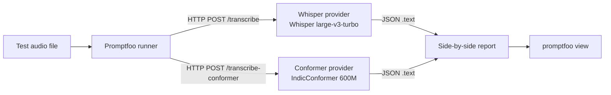

# STT A/B Test: Whisper large-v3-turbo vs IndicConformer 600M

**Started:** 2026-04-29
**Owners:** Anchit Som, Adamya Tripathi
**Status:** in flight — IndicConformer integration blocked on HuggingFace gate; Whisper side fully wired

---

## Why this test exists

The Bhai Sunn vision (`vision.md`) commits to two things at once: Hindi-first quality and a fully open-source local-first stack. The current STT default — Whisper large-v3-turbo via mlx-whisper — gives us a strong general baseline with native MLX on Apple Silicon, MIT licence, 809M params, and a measured 540ms warm latency on a 2.1s Hindi utterance.

Whisper is a multilingual generalist. AI4Bharat's IndicConformer is an Indic specialist: 600M params, hybrid CTC + RNNT, MIT licence, 22 official Indian languages including Hindi. Both fit our open-source thesis. The empirical question is which one transcribes Hindi audio more accurately for our actual use case (household speech, Hinglish code-switching, varied accents, regional pronunciation), at what latency cost.

This document records the discussion, the harness design, and the interim findings. It is the source of truth for the A/B test until results land.

---

## Models in the comparison

### A. Whisper large-v3-turbo (incumbent)

- **Source:** `openai/whisper-large-v3-turbo` on HuggingFace, `mlx-community/whisper-large-v3-turbo` for MLX
- **Licence:** MIT
- **Architecture:** Whisper large-v3 with the decoder pruned from 32 to 4 layers
- **Parameters:** 809M
- **Runtime:** native MLX on Apple Silicon, very fast
- **Measured warm latency on Mac Studio M1 Max:** 465ms STT on a 2.1s audio (full pipeline 540ms incl. ffmpeg decode + edge-silence trim)
- **Hindi training data:** broad multilingual corpus, no Indic-specific fine-tuning
- **Already wired into:** `prototype/stt_server.py` `/transcribe` endpoint

### B. IndicConformer 600M Multilingual (challenger)

- **Source:** `ai4bharat/indic-conformer-600m-multilingual` on HuggingFace
- **Licence:** MIT
- **Architecture:** Multilingual Conformer-based hybrid CTC + RNNT decoder
- **Parameters:** 600M (also a 120M Hindi-only variant exists per AIKosh)
- **Runtime:** HuggingFace transformers with `trust_remote_code=True`, plus torch/torchaudio/onnxruntime; no native MLX wrapper
- **Hindi training:** AI4Bharat's curated IN-22 corpus, designed for Indian languages
- **Status:** **gated repository.** Both `ai4bharat/indic-conformer-600m-multilingual` and `ai4bharat/IndicConformer` return 401 without an authenticated HF token. Unblocking step is documented below.

---

## Why not the other candidates

### indic-seamless: rejected on licence and on architectural mismatch

`ai4bharat/indic-seamless` is a 2B SeamlessM4T-v2 fine-tune, real and well-resourced, with a claim of "SOTA on FLEURS Hindi" in the model card. Two reasons it is out of this comparison:

1. **CC BY-NC 4.0 licence.** Non-commercial. A "Hindi-first, fully open-source alternative to Alexa for Indian households" cannot ship a non-commercial model. Forks of the project for Marathi, Bhojpuri, Tamil, or any commercial deployment cannot legally use it.

2. **It is a translation model, not a pure ASR model.** The arxiv paper (2411.04699) measures it with **ChrF++**, which is a translation quality metric, not WER. Its strength is Hindi audio → English text (or any cross-language pair). For our problem — Hindi audio → Hindi text, with no translation step — Conformer's architecture is a more direct fit.

### Sarvam Saaras V3, Gemini 3 Pro, Google Chirp: oracles, not production

All three are API-only and proprietary. Using any of them in the production wire breaks the local-first thesis (`vision.md`), and any household audio they touch lands on a third-party server. They have a useful role in the test as **quality oracles**: a one-shot pass on the same audio gives us an upper bound on accuracy and tells us how much we're paying for being local. They are not candidates for the production STT slot.

---

## Harness design

We are using **Promptfoo** as the eval driver. Promptfoo lets us define multiple "providers" (each a callable model or HTTP endpoint), pass the same input through all of them per test case, and view results side-by-side. The wiki-llm project (`projects/experiments/wiki-llm_liv/promptfoo-setup-and-ab-guide.md`) already established the convention; we reuse it here.

### Architecture



Both providers point at the same FastAPI server (`prototype/stt_server.py`) on localhost:8765. The server hosts the warmed Whisper model and (once unblocked) the warmed Conformer model, exposing them on separate paths.

### Why HTTP providers, not Python providers

Promptfoo supports inline Python providers, but every test invocation re-imports the model. For ASR with multi-GB models, the cold-start tax wipes out the test loop. Persistent HTTP is the right shape: model warm, latency representative of production, no per-test reload.

### Eval shape (v0): side-by-side compare, no assertions

Without ground-truth Hindi reference transcripts, we cannot compute WER. v0 of this harness is **compare mode only**: each test case produces two transcripts; you read them side by side and judge which is more faithful to the audio.

This is fast to set up, fast to run, and fast to extend — but it is comparison, not measurement. The discipline upgrade is below.

### Eval shape (v1): WER against ground truth

Once we have a small labelled set — even ten utterances we hand-transcribe ourselves — we add a Python assertion:

```yaml
assert:
  - type: python
    value: |
      from jiwer import wer
      return wer(context["vars"]["ground_truth"], output) < 0.20
```

Each test case includes the audio path *and* its hand-transcribed reference; Promptfoo computes WER per provider and reports a pass/fail plus the actual rate. This is the form a real ASR eval takes.

### Eval shape (v2, optional): LLM-judge

If we want a per-utterance "which transcript is more faithful" verdict without hand-transcribing, we layer in an LLM judge — Gemini or GPT-4 — that hears the audio, sees both transcripts, and picks the better one with a justification. Useful for spot-checks where a hand-reference would be expensive.

We do not need v2 for the project's decision. v0 plus v1 on a 30-utterance set is sufficient.

---

## Endpoints

The persistent STT server (`prototype/stt_server.py`) exposes:

| Path | Method | Body | Returns |
|---|---|---|---|
| `/health` | GET | — | warmed status, model identifier, language |
| `/transcribe` | POST | `{path, vad_trim}` | `{text, audio_seconds_*, timings}` (Whisper) |
| `/transcribe-conformer` | POST | `{path, decoder}` | `{text, decoder, timings}` (Conformer; pending) |

The Conformer endpoint accepts an optional `decoder` parameter — `ctc` or `rnnt` — because the model supports both decoding modes from the same forward pass and they produce subtly different output. CTC is faster and streaming-friendly; RNNT is typically more accurate. We benchmark both.

---

## Interim test set

Two voice notes received via Telegram on 2026-04-29:

| Test case | Audio | Whisper transcript | Notes |
|---|---|---|---|
| 1 | `/Users/anchitsom/.claude/channels/telegram/inbox/1777478093345-...oga` | "बाई सुन कैसा है" | "Bhai" rendered as "बाई". Expected speech: "Bhai Sunn kaisa hai". 540ms warm latency. |
| 2 | `/Users/anchitsom/.claude/channels/telegram/inbox/1777479556339-...oga` | "बाइस सुन अदम्यागी ना पैंट फड़ गी" | Whisper appears to hallucinate the middle. Likely cause is forced `language='hi'` over partial English / proper-noun content. Latency 556ms. |

Both are in the eval config. As more voice notes come in we extend the test set; the audio paths are stable since downloads land in the channel inbox.

---

## Findings already in hand (Whisper side)

1. **Latency is solved at the STT layer.** The persistent server hits 540ms warm on short Hindi utterances. Within budget for the 800-1500ms full assistant target documented in the architecture's felt-latency analysis.

2. **Whisper drops aspirated consonants.** "भ" (bh) → "ब" (b) on short utterances. The "बाई" output for "Bhai" is an instance of a class. For the wake-word path this is irrelevant (the wake-word model is the gate, not Whisper). For verbatim transcription it matters and would need either an `initial_prompt` bias or a Hindi-specific model.

3. **Whisper hallucinates on ambiguous middles.** Voice note 2 shows the failure mode: real speech at the edges, plausible-sounding nonsense in the middle. Forced `language='hi'` worsens it because it constrains decoding to Hindi tokens even when the audio has English fragments.

The IndicConformer A/B is set up exactly to test whether a Hindi-trained, ASR-specialised model fixes either of these failures.

---

## Unblocking the IndicConformer side

The HuggingFace repo is gated. Steps to unblock:

1. Visit https://huggingface.co/ai4bharat/indic-conformer-600m-multilingual while logged into HuggingFace
2. Click the gate accept (typically a click-through form for AI4Bharat models)
3. Generate a read-only token at https://huggingface.co/settings/tokens
4. Authenticate the venv: `HF_TOKEN=hf_... .venv/bin/python -m huggingface_hub.commands.huggingface_cli login --token $HF_TOKEN` *(or set `HF_TOKEN` in the server environment before launching uvicorn)*

Once the token is present, restarting the STT server triggers the lazy load on the first request to `/transcribe-conformer`. The model is roughly 2.4 GB resident at fp32, fits comfortably on Mac Studio.

---

## Build order

1. ✅ Verified survey of Hindi STT options (`research/hindi-stt-models-2026-04-29.md`)
2. ✅ Decision: IndicConformer 600M as the A/B candidate; indic-seamless rejected
3. ✅ Whisper provider live on `/transcribe`, 540ms warm
4. ✅ Promptfoo eval config (`eval/`) with both providers and the two-test-case set
5. 🔒 IndicConformer integration — blocked on HuggingFace gate
6. ⏳ Add `/transcribe-conformer` endpoint with CTC and RNNT modes to `stt_server.py`
7. ⏳ First side-by-side run on the two existing voice notes
8. ⏳ Hand-transcribe a 10-30 utterance Hindi reference set; upgrade eval to v1 (WER assertions)
9. ⏳ Decision: stay on Whisper, switch to IndicConformer, or run both with a router (e.g. Conformer for Hindi-only, Whisper for Hinglish)

---

## Open questions

- **CTC vs RNNT.** The 600M model exposes both. RNNT typically wins on accuracy by a few WER points; CTC wins on streaming and latency. Worth running both modes in the eval.
- **120M Hindi-only variant.** AIKosh references a 120M Conformer-Large Hindi-specific model. Smaller, potentially faster, possibly tighter on Hindi quality. If it is also gated, same authentication path; if not, candidate for the satellite-side build (where the brain is not available).
- **Sarvam Saaras V3 oracle pass.** One API call per test utterance gives us a strong-baseline upper bound. Useful once we have ground truth — until then it is a third opinion in compare mode.
- **Hand-labelled reference set.** Who transcribes, in what notation (Devanagari only? Devanagari + Roman for Hinglish?), how many utterances. Need to converge on a small standard before v1 of the eval.

---

## Discussion archive

The conversation that produced this design, in order:

1. User proposed an A/B against IndicSeamless
2. Initial Gemini-CLI survey hallucinated a non-existent "IndicWhisper v2" and a fake NVIDIA Neotron release with confident benchmark percentages
3. User caught the IndicWhisper v2 hallucination and asked for a native WebSearch + WebFetch survey
4. Verified survey clarified that indic-seamless is a translation model (ChrF++), not a pure ASR model, and that the licence is CC BY-NC 4.0 — both reasons to reject it for our use case
5. Verified survey identified IndicConformer 600M as the right MIT-licensed Indic ASR challenger
6. User authorised the A/B with Conformer
7. Install path was documented (transformers + torch + onnxruntime + librosa); Ollama was clarified as not applicable to ASR (only text LLMs in GGUF)
8. HuggingFace gate discovered on the model repo; authentication step documented; the rest of the harness built around the stub so the model plugs in once unblocked

The thread of small but real corrections (Gemini hallucination → user catch → verified survey → architectural distinction → licence check → gate discovery) is preserved here so future maintenance does not relitigate the same questions.

---

## References

- `vision.md` — open-source / local-first thesis the licence decisions rest on
- `architecture.md` — RAM budget and latency targets the harness measures against
- `prototype/stt_server.py` — the persistent server hosting both providers
- `eval/promptfooconfig.yaml` — the Promptfoo config Promptfoo runs
- `research/hindi-stt-models-2026-04-29.md` — the survey that led to the IndicConformer choice
- [`ai4bharat/indic-conformer-600m-multilingual`](https://huggingface.co/ai4bharat/indic-conformer-600m-multilingual) — challenger model
- [`mlx-community/whisper-large-v3-turbo`](https://huggingface.co/mlx-community/whisper-large-v3-turbo) — incumbent model
- [Saaras V3 launch blog](https://www.sarvam.ai/blogs/asr) — context for the oracle option
